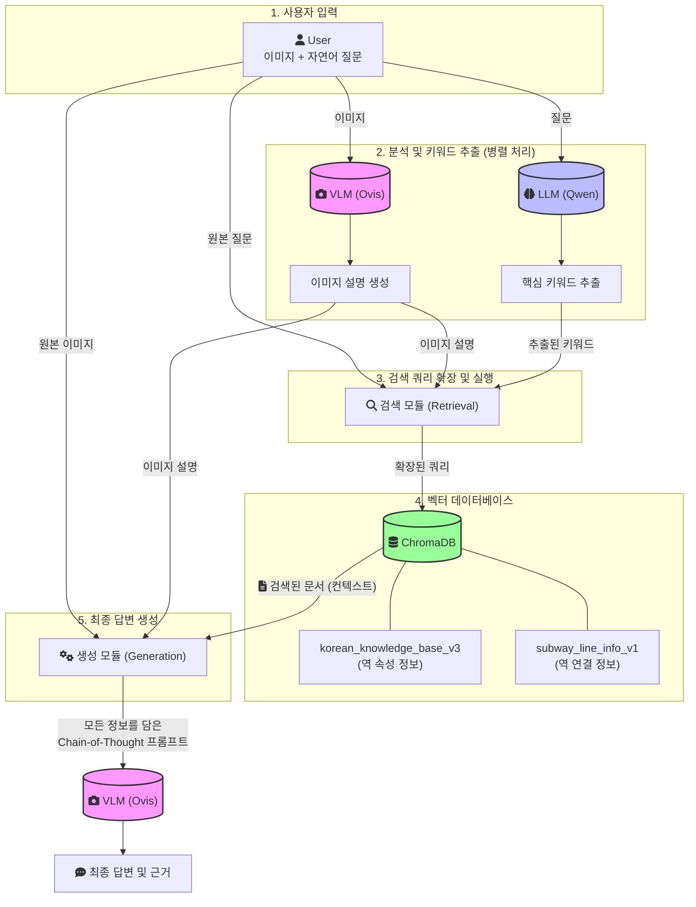

# V2 하이브리드 RAG 아키텍처

```mermaid
graph TD
    subgraph "1. 사용자 입력"
        UserInput["fa:fa-user User<br>이미지 + 자연어 질문"]
    end

    subgraph "2. 분석 및 키워드 추출 (병렬 처리)"
        UserInput -- 이미지 --> VLM_Desc[("fa:fa-camera VLM (Ovis)")]
        VLM_Desc --> GenDesc["이미지 설명 생성"]

        UserInput -- 질문 --> LLM_Keyword[("fa:fa-brain LLM (Qwen)")]
        LLM_Keyword --> GenKeyword["핵심 키워드 추출"]
    end

    subgraph "3. 검색 쿼리 확장 및 실행"
        RetrievalModule["fa:fa-search 검색 모듈 (Retrieval)"]
        UserInput -- 원본 질문 --> RetrievalModule
        GenDesc -- 이미지 설명 --> RetrievalModule
        GenKeyword -- 추출된 키워드 --> RetrievalModule
    end

    subgraph "4. 벡터 데이터베이스"
        VectorDB[(fa:fa-database ChromaDB)]
        CollectionV3["korean_knowledge_base_v3<br>(역 속성 정보)"]
        CollectionV1["subway_line_info_v1<br>(역 연결 정보)"]
        VectorDB --- CollectionV3 & CollectionV1
    end

    RetrievalModule -- 확장된 쿼리 --> VectorDB
    VectorDB -- "fa:fa-file-alt 검색된 문서 (컨텍스트)" --> GenerationModule

    subgraph "5. 최종 답변 생성"
        GenerationModule["fa:fa-cogs 생성 모듈 (Generation)"]
        UserInput -- 원본 이미지 --> GenerationModule
        GenDesc -- 이미지 설명 --> GenerationModule
    end

    GenerationModule -- "모든 정보를 담은<br>Chain-of-Thought 프롬프트" --> VLM_Final[("fa:fa-camera VLM (Ovis)")]
    VLM_Final --> FinalAnswer["fa:fa-comment-dots 최종 답변 및 근거"]

    style VLM_Desc fill:#f9f,stroke:#333,stroke-width:2px
    style LLM_Keyword fill:#bbf,stroke:#333,stroke-width:2px
    style VLM_Final fill:#f9f,stroke:#333,stroke-width:2px
    style VectorDB fill:#9f9,stroke:#333,stroke-width:2px
```
